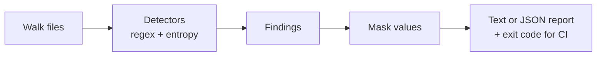

<!--
  README.md
-->

<p align="center">
  <!-- BADGES:START -->
  <a href="#"></a>
  <a href="#"></a>
  <!-- BADGES:END -->
</p>

# pii-secret-scanner

Author: Saina Kakkar

### Project Description
A DevSecOps command-line tool that catches leaked credentials before they
reach a public repository. It scans a codebase for secret-like content (API
keys, access tokens, passwords, private-key headers), masks the sensitive
values in its output, and returns CI-friendly exit codes so a pipeline can
block a leaky commit automatically.



## What It Detects

- Secret-like environment variable assignments (`API_KEY=...`, `PASSWORD=...`)
- Private-key headers (`-----BEGIN ... PRIVATE KEY-----`)
- GitHub-style and Slack-style tokens
- AWS-style access key IDs
- Long high-entropy strings that look like credentials

Findings are heuristic by design. The goal is to warn loudly before a push,
not to prove a string is a live credential.

## Quick Start

Scan the bundled sample project:

```bash
PYTHONPATH=src python -m secret_scanner scan examples/sample_project --no-fail
```

Write a JSON report (for CI artifacts or tooling):

```bash
PYTHONPATH=src python -m secret_scanner scan examples/sample_project --format json --out reports/findings.json
```

### Example Output

```
2 finding(s)

examples/sample_project/.env.example:1 [MEDIUM] Environment assignment with secret-like name
  value: API_****************-key

examples/sample_project/config.py:1 [MEDIUM] Environment assignment with secret-like name
  value: PASS*****************word
```

The values are masked on purpose. A secret scanner that
echoes full secrets back to the terminal, or into CI logs, would become a
leak vector itself. I kept the first and last few characters visible so you
can still tell which secret it found.

## CLI Reference

The `scan` subcommand takes these options:

| Argument | Default | What it does |
|---|---|---|
| `path` | (required) | File or directory to scan (directories are walked recursively) |
| `--format` | `text` | Report format: `text` or `json` |
| `--out` | none | Write the report to a file instead of only stdout |
| `--no-fail` | off | Always exit with code 0, even when findings exist |

Exit codes: `0` means no findings (or `--no-fail` was set), non-zero means
findings exist.

## CI Integration

Because of the exit-code contract, a single line in a pipeline gates the
build:

```yaml
- run: PYTHONPATH=src python -m secret_scanner scan .
```

Use `--no-fail` for report-only runs, for example a nightly job that
collects the JSON reports as artifacts without blocking anyone.

## Project Layout

```
src/secret_scanner/
  cli.py        argument parsing and the scan subcommand
  scanner.py    file walking and running the rules over each line
  rules.py      the detectors: env assignments, key headers, tokens, entropy
  reporting.py  text / json formatters and value masking
examples/sample_project/   a fake project with planted "secrets" to scan
tests/                     scanner, reporting, and CLI tests
```

Each rule in `rules.py` is a small, independent matcher. To add a new
detector you write one function and register it. Nothing else changes,
which is exactly what I wanted after my first attempt.

## Verify

```bash
PYTHONPATH=src python -m unittest discover -s tests
```

## Additional Notes

- **Tuning entropy was the annoying part.** A threshold that catches real
  tokens also flags things like git hashes and minified code. I settled on
  combining entropy with length and context (where the string appears)
  instead of entropy alone, which cut most of the noise in my test files.
- **One giant regex was the first attempt.** It became unreadable fast.
  Each rule is now a small, independent matcher that can be added or tuned
  without touching the scanning engine. My
  [mcpscan](https://github.com/sainakakkar2006/mcpscan) project later reused
  these detectors directly, which told me the split was right.
- **The failure modes get tests.** Output masking and exit-code behavior are
  unit-tested edge cases, not afterthoughts. For security tooling, the
  failure modes are exactly where tests matter.

## License

MIT. See the [LICENSE](LICENSE) file.
